# SoundModem P2P Chat

Single-file browser app implementing P2P text chat and file transfer over audio using AX.25 UI frames modulated as Bell 202 AFSK. Source lives in `src/` ES modules; `npm run build` produces a self-contained `dist/index.html`.

## Development workflow

```
idea → PRD (docs/research/) → plan (plans/) → feature branch → TDD → build → test → merge main → deploy
```

1. **Research / PRD** — write a design doc in `docs/research/<name>.md`
2. **Plan** — run `/prd-to-plan` to produce `plans/<name>.md` (vertical slices / tracer bullets)
3. **Branch** — `git checkout -b feature/<name>`
4. **TDD loop** — run `/tdd`; one RED→GREEN cycle per behaviour using Vitest (unit) + Playwright (integration)
5. **Build** — `npm run build` → `dist/index.html`
6. **All tests green** — `npm test && npx playwright test`
7. **Merge** — `git checkout main && git merge --no-ff feature/<name> && git push origin main`
8. **Deploy** — `rsync -av dist/index.html vesta03:/home/alexei/web/modem.kipr24.com/public_html/index.html`

## How to run

```bash
# Development (source modules, watch mode)
npm run dev
python3 -m http.server 8765
# open http://localhost:8765/index.html

# Production build (single-file, shareable)
npm run build
python3 -m http.server 8765
# open http://localhost:8765/dist/index.html
```

`file://` is blocked by browsers — `getUserMedia` and WebGPU both require a secure context (localhost qualifies).

## Deploy to production

Production URL: **https://modem.kipr24.com**

```bash
npm run build
rsync -av dist/index.html vesta03:/home/alexei/web/modem.kipr24.com/public_html/index.html
```

Server: `vesta03` (SSH alias) — docroot at `/home/alexei/web/modem.kipr24.com/public_html/`.

## Testing

```bash
npm test           # run all unit tests (105 tests, Vitest)
npm run test:watch # watch mode
```

Playwright integration tests use the live dev server at `http://localhost:8765`. The built `dist/index.html` exposes all pure functions on `window` for Playwright access.

## Build system

| Tool | Purpose |
|---|---|
| **Rollup 4** | Bundles `src/main.js` → `dist/bundle.js` (IIFE) |
| `scripts/build.js` | Inlines bundle into `src/index.html` → `dist/index.html` |
| **Vitest 3** | Unit test runner, Node environment, ESM-native |
| `.nvmrc` | Pins Node 22.21.1 (required for WebCrypto + CompressionStream in tests) |

```
npm run build      → dist/index.html  (38 KB, self-contained)
npm run dev        → rollup --watch
npm test           → vitest run
npm run test:watch → vitest
```

## Module structure

```
src/
  crc16.js             crc16(bytes) — CRC-16-CCITT
  ax25.js              encodeCallsign, bitStuff, buildFrame(msg,dst,src), buildFrameRaw(bytes,dst,src)
  dpll.js              DPLL class — clock recovery
  modulate.js          modulate(frameBytes) → Float32Array; exports AFSK constants
  goertzel.js          goertzel(samples, freq) — sliding Goertzel magnitude
  demodulate.js        createDemodulator({onMessage, onFilePacket}) — Bell 202 factory
  compress.js          compress(data) / decompress(data) — DeflateRaw streams
  crypto.js            deriveKey(passphrase) / encryptBytes(key, plain) / decryptBytes(key, cipher)
  packet.js            encodePacket({xferId,seq,total,filename?,data}) / decodePacket(bytes)
  fsm.js               S, E, transition(state,event,ctx), isAudioActive(state) — audio lifecycle FSM
  gpu.js               GpuDemodulator, initWebGpu(), getSharedGpuDevice() — Bell 202 WebGPU shaders
  ofdm.js              ofdmModulate(bits), ofdmDemodulateRaw(samples), ofdmEncodeFrameRaw(bytes) — OFDM core
  fec.js               convEncode(bits), viterbiDecode(bits), interleave/deinterleave — Rate-1/2 K=7
  ofdm-demodulate.js   createOfdmDemodulator({onMessage, onFilePacket, onStats}) — OFDM RX pipeline
  ofdm-gpu.js          GpuDft class, initGpuDft(device?) — WGSL 256-pt direct DFT
  ui.js                addChat, populateMicList — DOM helpers
  main.js              entry point; wires modules, manages FSM state, exposes window.* globals

test/
  crc16.test.js · ax25.test.js · dpll.test.js · modulate.test.js · goertzel (in ax25)
  demodulate.test.js · packet.test.js · compress.test.js · crypto.test.js · loopback.test.js
  ofdm.test.js · fec.test.js · ofdm-loopback.test.js · fsm.test.js · file-transfer.test.js

src/index.html    HTML template (<!-- BUNDLE --> placeholder)
dist/index.html   built output — hand this to testers
```

Key architectural decisions:
- `buildFrame`/`buildFrameRaw` take an explicit `src` callsign parameter (not module state).
- `createDemodulator` encapsulates `demodBits`, `scanPos`, `sampleBuffer`, and `DPLL` state in a closure; state is not globally accessible.
- Application lifecycle is managed by a hand-rolled FSM (`src/fsm.js`). `transition()` is a pure function; all side effects are in `handleStateEntry()` in `main.js`.
- File TX uses a pause gate: `sendFile` awaits a `Promise` between fragments; pause replaces it with a pending `Promise`, resume/cancel resolve it — no polling.

---

## Tech stack

| Layer | Technology |
|---|---|
| Language | Vanilla JavaScript (ES2020 modules), no frameworks |
| Build | Rollup 4 — IIFE bundle inlined into HTML |
| Tests | Vitest 3 (unit) + Playwright MCP (integration) |
| Audio I/O (Bell 202) | Web Audio API — `ScriptProcessor` (deprecated but functional) |
| Audio I/O (OFDM) | `AudioWorklet` (inlined as Blob URL) — off-main-thread processing |
| Mic access | `navigator.mediaDevices.getUserMedia` |
| Encryption | Web Crypto API — PBKDF2 → AES-GCM-256 |
| Compression | `CompressionStream` / `DecompressionStream` (DeflateRaw) |
| Framing | AX.25 UI frames |
| Modulation | Bell 202 AFSK, 1200 baud |
| RX demod (primary) | WebGPU compute — FM discriminator (WGSL) |
| RX demod (fallback 1) | WebGPU compute — parallel Goertzel (WGSL) |
| RX demod (fallback 2) | CPU Goertzel (JavaScript) |
| Clock recovery | DPLL (Digital Phase-Locked Loop) |

---

## Signal chain

### TX

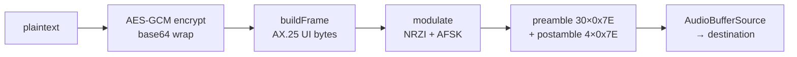

### TX (file)

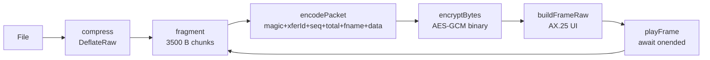

### RX

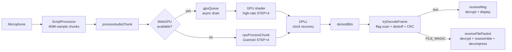

---

## Demodulator selection

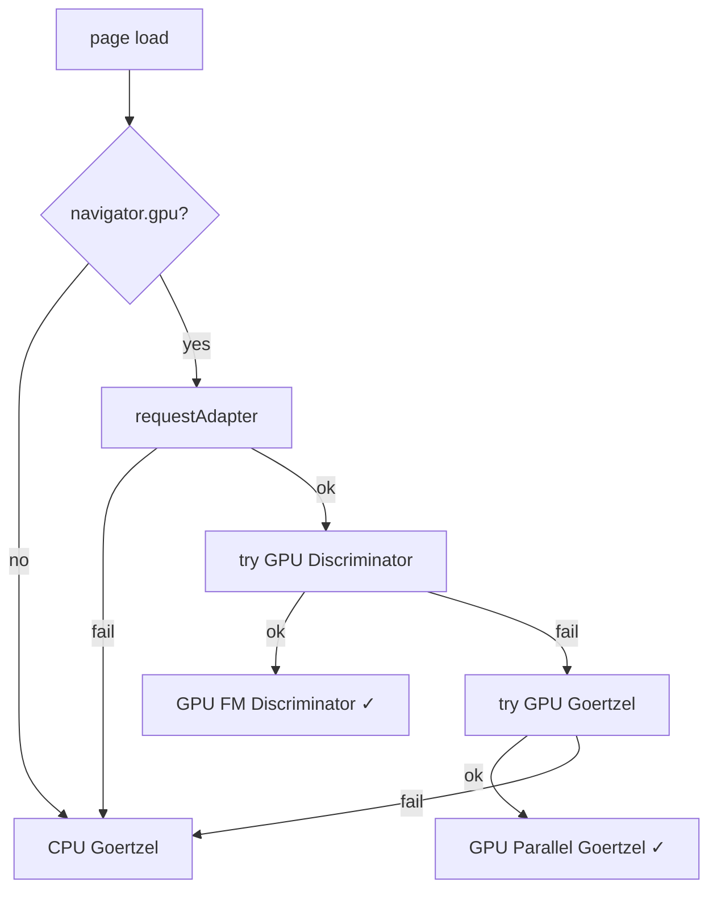

The active mode is shown in the `#demod-mode` label next to the status indicator.

---

## Bell 202 AFSK parameters

| Constant | Value | Meaning |
|---|---|---|
| `MARK_FREQ` | 1200 Hz | Logic 1 / no NRZI transition |
| `SPACE_FREQ` | 2200 Hz | Logic 0 / NRZI transition |
| `SAMPLE_RATE` | 44100 Hz | Audio sample rate |
| `BAUD` | 1200 | Symbols per second |
| `SPB` | 36 | `⌊44100 / 1200⌋` — samples per bit |
| `STEP` | 4 | Goertzel stride — high-rate samples between estimates |
| `OMEGA_NOM` | 9 | `SPB / STEP` — nominal DPLL period in high-rate steps |

---

## Preamble and postamble

Every TX frame is wrapped with flag bytes to allow the receiver's DPLL to lock before data arrives:

| Constant | Value | Purpose |
|---|---|---|
| `PREAMBLE_FLAGS` | 30 | 30 × 0x7E before frame — 30 × 8 = 240 bits for DPLL lock |
| `POSTAMBLE_FLAGS` | 4 | 4 × 0x7E after frame — flush the decoder's bit buffer |

The 0x7E flag (`01111110` LSB-first) produces an alternating pattern under NRZI: 7 symbols of one frequency then 1 symbol of the other, giving 2 transitions per flag for the DPLL to lock onto.

---

## High-rate demodulation and DPLL

All three demodulators produce a **high-rate frequency stream** at `SAMPLE_RATE / STEP = 11025` estimates/sec (one isMark boolean every 4 audio samples). This ~9× oversampling drives the DPLL for clock recovery.

### Why STEP=4 with a full SPB=36 window is tricky

The Goertzel window is SPB=36 samples wide — exactly one symbol period. Each high-rate step advances the window by only STEP=4 samples. This means the window at step `n` covers `[n×4, n×4+36)`. At the **last step** of a symbol period, the window already extends 32 samples into the *next* symbol, making a majority vote over all 9 steps incorrect (it would vote for the wrong symbol at transitions).

**Solution:** sample the frequency at the **first step** of each symbol period (`phase < 1` after phase reset), where the window `[k×36, k×36+36)` is perfectly aligned with symbol `k` — no inter-symbol bleed.

### DPLL algorithm

```
OMEGA_NOM = SPB / STEP = 9.0      nominal steps per symbol
α = 0.1                            phase correction gain
β = 0.0002                         frequency correction gain
```

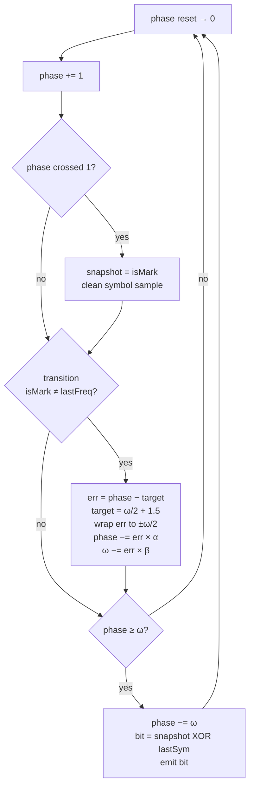

**Phase target derivation:** When an NRZI transition occurs at sample boundary `T = k×SPB`, the Goertzel output flips at high-rate step `n ≈ (T − SPB/2) / STEP = k×OMEGA_NOM − OMEGA_NOM/2`. Relative to the last symbol emission (which fires 1 step early due to phase-first increment), transitions arrive at phase ≈ `OMEGA_NOM/2 + 1.5 = 6.0`. This is the correction target.

**Symbol sampling:** `snapshot` is captured at `prevPhase < 1` (the step where `phase` first crosses 1 after a reset). At that step the Goertzel window is exactly `[k×SPB, k×SPB+SPB)` — one clean symbol, no straddling.

### DPLL state variables

| Variable | Initial | Purpose |
|---|---|---|
| `omega` | `OMEGA_NOM` | Current estimated symbol period in high-rate steps |
| `phase` | `0` | Phase accumulator within current symbol |
| `snapshot` | `true` | Frequency captured at symbol start for bit decision |
| `lastFreq` | `true` | Previous high-rate sample (for transition detection) |
| `lastSymFreq` | `true` | Frequency at previous symbol (for NRZI decode) |

### `tryDecodeFrame` performance

The outer flag-scan loop uses a persistent `scanPos` offset so each bit is only scanned once across successive `tryDecodeFrame` calls. Without this, a 36 000-bit buffer × O(n) inner scans per spurious flag match ≈ millions of iterations every 93 ms, blocking the main thread and starving the audio callback.

The buffer tail is capped at 36 000 bits — enough for one max-size file packet (3500 B chunk + overhead ≈ 34 000 bits) without unbounded growth.

---

## WebGPU demodulators

Both GPU demodulators produce a **high-rate** frequency stream (one isMark per STEP=4 samples), fed into the same DPLL as the CPU path. NRZI decoding and DPLL always run on the CPU after the GPU returns.

### Shared GPU buffer layout

```
paramBuf   (32 B, uniform)    — shader params (see per-mode fields below)
sampleBuf  (16 KB, storage)   — input Float32 audio samples (max 4096)
bitsBuf    (~4 KB, storage)   — output u32 isMark flags (max positions = ⌊4096/STEP⌋)
readBuf    (~4 KB, MAP_READ)  — CPU readback copy of bitsBuf
```

### Option 2 — Parallel Goertzel (`GOERTZEL_WGSL`)

One GPU thread per high-rate position. Each thread computes squared Goertzel magnitude for MARK and SPACE over a SPB-sample window.

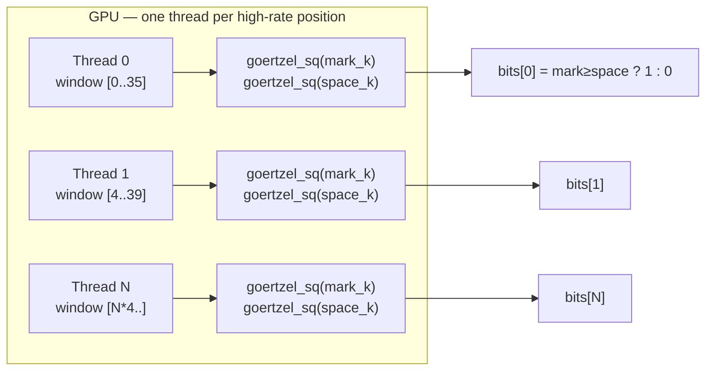

Uniform params:

| Offset | Field | Value |
|---|---|---|
| 0 | `num_samples` | chunk length (≤ 4096) |
| 4 | `num_positions` | `⌊(num_samples − SPB) / STEP⌋ + 1` |
| 8 | `spb` | 36 |
| 12 | `step` | 4 |
| 16 | `mark_k` | `2π × 1200 / 44100 ≈ 0.1711` |
| 20 | `space_k` | `2π × 2200 / 44100 ≈ 0.3138` |

Uses **squared** DFT magnitude (avoids `sqrt`).

### Option 3 — FM Discriminator (`DISCRIMINATOR_WGSL`)

One GPU thread per high-rate position. Mixes with a complex carrier at `fc = 1700 Hz` (midpoint of MARK/SPACE) then computes the cross-product FM discriminant.

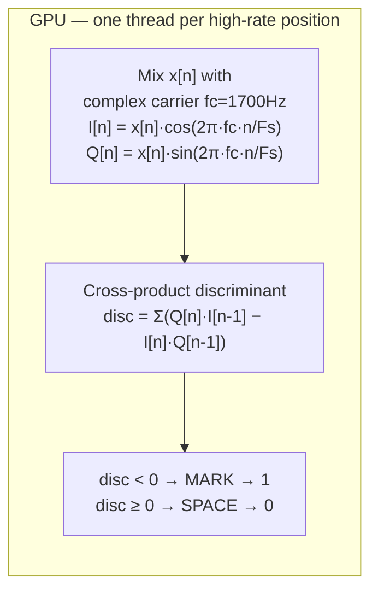

Uniform params:

| Offset | Field | Value |
|---|---|---|
| 0 | `num_samples` | chunk length |
| 4 | `num_positions` | `⌊(num_samples − SPB) / STEP⌋ + 1` |
| 8 | `spb` | 36 |
| 12 | `step` | 4 |
| 16 | `center_phase_inc` | `2π × 1700 / 44100 ≈ 0.2422` |

**Why the discriminator is better than Goertzel:**
- Phase-invariant — result does not depend on where in the carrier cycle the symbol starts
- Naturally implements an FM discriminator — the cross-product `Q[n]·I[n-1] − I[n]·Q[n-1]` is proportional to instantaneous frequency deviation from `fc`
- Better noise rejection on weak or distorted signals

**Edge case:** The first position in each chunk (`off == 0`) has no prior sample for the differential; it defaults to MARK (`bits[0] = 1u`) and is harmless at 93 ms chunk intervals.

---

## GPU async processing

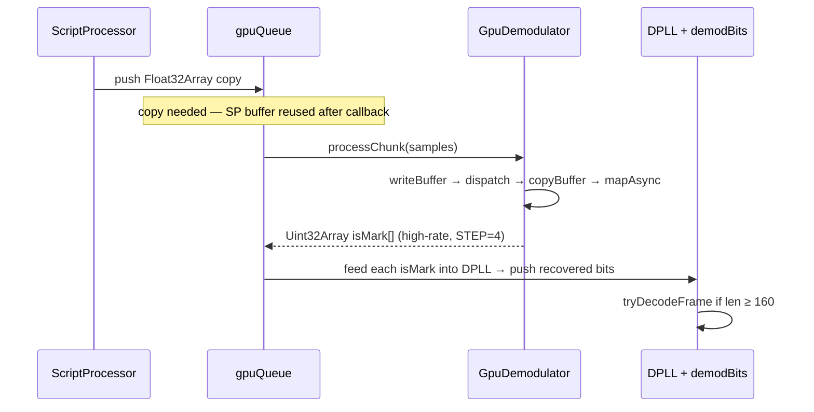

`gpuBusy` flag serialises queue draining — only one `mapAsync` in flight at a time.

---

## File transfer packet format

```
Bytes 0–1:   0xFE 0xFF              magic (FILE_MAGIC)
Bytes 2–3:   xferId                 random 2-byte transfer ID (same for all fragments)
Bytes 4–5:   seq                    big-endian uint16, 0-based fragment index
Bytes 6–7:   total                  big-endian uint16, total fragment count
seq=0 only:  [fnameLen 2B][fname UTF-8]
Then:        compressed file data chunk (up to CHUNK_SIZE=3500 B)
```

Entire payload is AES-GCM encrypted before being placed in the AX.25 data field. On receive, `FILE_MAGIC` is detected in `tryDecodeFrame` before the frame is dispatched to `receiveFilePacket`.

| Constant | Value | Purpose |
|---|---|---|
| `FILE_MAGIC` | `[0xFE, 0xFF]` | Distinguishes file packets from text messages |
| `CHUNK_SIZE` | 3500 B | Compressed data per fragment |

---

## AX.25 frame format

```
[0x7E] [DST 7B] [SRC 7B] [CTRL 0x03] [PID 0xF0] [DATA ... ] [FCS HI] [FCS LO] [0x7E]
```

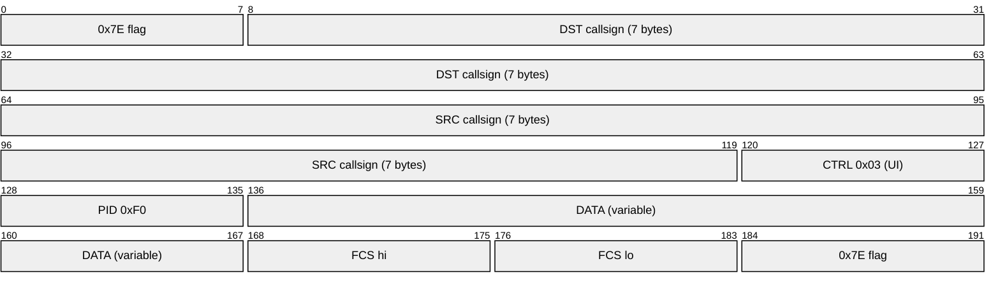

- **Callsigns:** 6 ASCII chars padded with spaces, each byte **shifted left 1 bit**, followed by a 7th SSID byte (`0x60` for dst, `0x61` for src)
- **FCS:** CRC-16-CCITT (poly `0x1021`, init `0xFFFF`) over `DST + SRC + CTRL + PID + DATA` — excludes the `0x7E` flags and the FCS itself
- **Bit stuffing:** insert `0` after every 5 consecutive `1`s in the frame content, **before** NRZI; the `0x7E` flag bytes are exempt
- **NRZI:** `0` bit → toggle frequency; `1` bit → keep current frequency
- **Frame size cap:** inner flag-scan loop capped at 32 768 bits to support file transfer packets (~4 KB data)

### Modulation pipeline

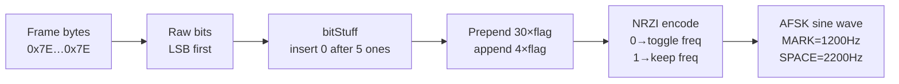

---

## Encryption

Optional symmetric encryption. Both peers must use the same passphrase.

- Key derivation: PBKDF2 (SHA-256, 100 000 iterations, 16-byte zero salt) → AES-GCM-256
- Text wire format: `base64(12-byte-IV ‖ AES-GCM-ciphertext)` in the AX.25 data field
- Binary (file) wire format: raw `12-byte-IV ‖ AES-GCM-ciphertext` bytes (no base64)
- `cryptoKey` is derived once and cached; stopping and restarting audio clears it

---

## Audio graph

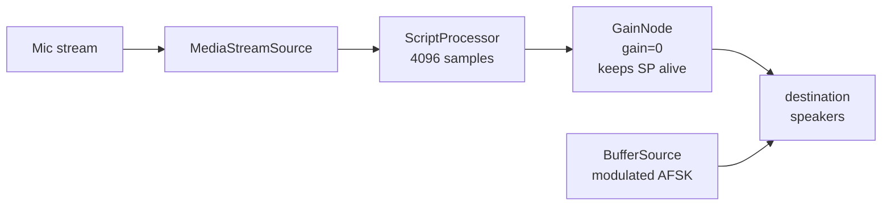

The zero-gain node is required: `ScriptProcessor` only fires `onaudioprocess` when connected to the graph. Gain=0 prevents mic passthrough (no feedback). TX audio connects directly to `destination`, bypassing the RX chain.

---

## Microphone selection

On page load `populateMicList()` does a temporary `getUserMedia` grant to read device labels, then populates the `<select>`. Devices whose label contains `"webcam"` or `"general"` are pre-selected (targets "General - Webcam Microphone"). After `toggleAudio()` grants the real permission, `populateMicList()` re-runs so full labels are visible.

---

## `data-testid` attributes

| Value | Element |
|---|---|
| `callsign-input` | Callsign text field |
| `passphrase-input` | Passphrase password field |
| `mic-select` | Microphone device dropdown |
| `toggle-btn` | Start / Stop Audio button |
| `status` | Status label (Stopped / Running / Error) |
| `demod-mode` | Active demodulator label (`Bell202` / `OFDM-CPU` / `OFDM-GPU`) |
| `ofdm-snr` | Pilot SNR badge (hidden in Bell 202 mode) |
| `ofdm-phase-err` | Pilot phase error badge (hidden in Bell 202 mode) |
| `modem-mode-select` | Bell202 / OFDM-HF mode selector |
| `chat-log` | Chat message container |
| `message-input` | Outgoing message text field |
| `send-btn` | Send button |
| `send-file-btn` | Send File button |
| `chat-entry-tx` | TX message div (green) |
| `chat-entry-rx` | RX message div (blue) |
| `chat-entry-err` | Error message div (red) |
| `chat-entry-file` | File transfer status div |
| `xfer-progress` | File transfer progress panel (hidden when idle) |
| `xfer-progress-bar` | Bootstrap progress bar fill element |
| `pause-resume-btn` | Pause / Resume toggle button |
| `cancel-xfer-btn` | Cancel transfer button |

---

## Window globals exposed for testing

`dist/index.html` exposes these on `window` for Playwright integration tests:

| Global | Source |
|---|---|
| `buildFrame(msg, dst, src)` | `src/ax25.js` |
| `buildFrameRaw(bytes, dst, src)` | `src/ax25.js` |
| `modulate(frameBytes)` | `src/modulate.js` |
| `cpuProcessChunk(samples)` | Bell 202 `demodulator` instance in `main.js` |
| `resetDemodulator()` | `demodulator.reset()` |
| `ofdmEncodeFrame(text)` | OFDM TX — returns `Float32Array` audio samples |
| `ofdmProcessChunk(samples)` | OFDM RX — feeds samples into the active OFDM demodulator |
| `compress(data)` / `decompress(data)` | `src/compress.js` |
| `createDemodulator({onMessage, onFilePacket})` | `src/demodulate.js` |
| `DPLL` | `src/dpll.js` |
| `crc16`, `bitStuff`, `encodeCallsign`, `goertzel` | pure modules |
| `MARK_FREQ`, `SPACE_FREQ`, `SAMPLE_RATE`, `SPB`, `STEP`, `PREAMBLE_FLAGS`, `POSTAMBLE_FLAGS` | `src/modulate.js` |
| `togglePauseTx()` | Pause or resume the active file transfer |
| `cancelTx()` | Cancel the active file transfer |

---

## FSM states and events

`src/fsm.js` — pure `transition(state, event, context)` function; no side effects.

### States

| State | Meaning |
|---|---|
| `idle` | Page loaded, no audio running |
| `requesting-mic` | `getUserMedia` in flight |
| `mic-denied` | Microphone permission denied |
| `initializing` | AudioContext + GPU/worklet setup in progress |
| `running` | Audio active and demodulating |
| `tx` | Transmitting — speaker busy, chat controls disabled |
| `tx-paused` | Between TX fragments — speaker idle, chat re-enabled |
| `stopping` | Teardown in progress |
| `error` | Unrecoverable hardware failure |

### Key transitions

```
idle         + START          → requesting-mic
requesting-mic + MIC_GRANTED  → initializing
initializing + HARDWARE_READY → running
running      + START_TX       → tx
tx           + PAUSE_TX       → tx-paused
tx-paused    + RESUME_TX      → tx
tx-paused    + CANCEL_TX      → running
tx           + TX_DONE        → running
running      + STOP           → stopping   (also valid from tx / tx-paused)
stopping     + STOPPED        → idle
```

`isAudioActive(state)` returns true for `requesting-mic`, `initializing`, `running`, `tx`, `tx-paused`, `stopping`.

---

## Known limitations / future work

- `ScriptProcessor` still used for Bell 202 mode — migrate to `AudioWorklet` for production use (OFDM already uses AudioWorklet)
- Zero-salt PBKDF2 is weak against offline dictionary attacks
- No carrier detect — demodulator starts immediately on any audio; add squelch for VHF use
- Broadcast only (destination hardcoded to `ALL`)
- First high-rate position per GPU chunk is skipped by the discriminator (needs prior-sample differential)
- WebGPU `mapAsync` adds ~1–5 ms latency per chunk; imperceptible at 1200 baud
- DPLL uses phase-first-increment, making the effective sample point `phase < 1` (symbol start); midpoint sampling would give better noise margin on weak signals
- File transfer: no ARQ (retransmit on loss) or FEC — planned for maritime use case
